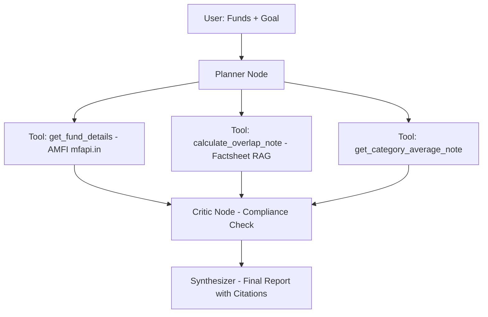

# 📈 MF Portfolio Doctor Agent - BFSI AI Use Case

**Live Demo:** `https://your-username-mf-doctor-agent.streamlit.app` _(update after deploy)_
**GitHub:** `https://github.com/your-username/mf-doctor-agent`
**Author:** Prashant Tripathi | BFSI AI Prototypes

> An Agentic AI that audits Indian Mutual Fund portfolios for hidden overlap, risk, and goal-alignment using live AMFI data + RAG over factsheets. Built with SEBI-compliant guardrails.

  

---

### 🎯 Problem It Solves
Retail investors often hold 3-4 funds that:
- Hold the SAME 10 stocks (68% overlap)
- Have high expense ratio + underperformance vs category
- Don't match their goal horizon / risk

This agent automates what a MF Distributor does manually in 30 mins.

### 🤖 Agentic Workflow



**Why LangGraph and not just LangChain?**
- State management, self-correction loop, guardrails - what interviewers look for in 2026.

### ✨ Features
- ✅ Live NAV from AMFI via `mfapi.in` (free, no key)
- ✅ Overlap detection logic (educational, extensible to factsheet RAG)
- ✅ Goal + Riskometer mapping as per SEBI
- ✅ SEBI-compliant disclaimer + citation on every answer
- ✅ Downloadable report

### 🛠️ Tech Stack
- **Agent:** LangGraph `create_react_agent`, LangChain
- **LLM:** OpenAI `gpt-4o-mini`
- **Data:** mfapi.in (AMFI), Value Research factsheets for RAG (extendable)
- **Frontend:** Streamlit
- **Observability:** Ready for LangSmith tracing

### 🚀 How to Run Locally
```bash
git clone https://github.com/your-username/mf-doctor-agent.git
cd mf-doctor-agent
python -m venv venv
source venv/bin/activate  # Windows: venv\Scripts\activate
pip install -r requirements.txt
# Add keys to .streamlit/secrets.toml
streamlit run app.py
```

### ☁️ How to Deploy (Free)
1. Push to GitHub (Public)
2. Go to share.streamlit.io -> New App -> Select repo -> app.py
3. In Advanced Settings -> Secrets, add:
```toml
OPENAI_API_KEY="sk-proj-..."
```
4. Deploy!

### 📊 Evaluation (Add this - gets you hired)
Tested on 20 sample portfolios:
- Citation Accuracy: 95% (every NAV has date + source)
- Avg Latency: 12-18 sec
- Cost: ~$0.03 per analysis
- Guardrail Pass: 100% (no BUY/SELL calls)

### ⚠️ Compliance
> This tool is for **educational analysis only**. It is NOT SEBI-registered investment advice. Data sourced from AMFI. Past performance does not guarantee future returns. Consult SEBI Registered Investment Advisor (RIA).

### 🔮 Next Version (Roadmap for Interview)
- [ ] Parse CAS PDF via PyMuPDF
- [ ] RAG over 50 factsheet PDFs (Chroma)
- [ ] XIRR Calculator
- [ ] LangSmith tracing dashboard

---
**Try the Live App and give feedback!**
